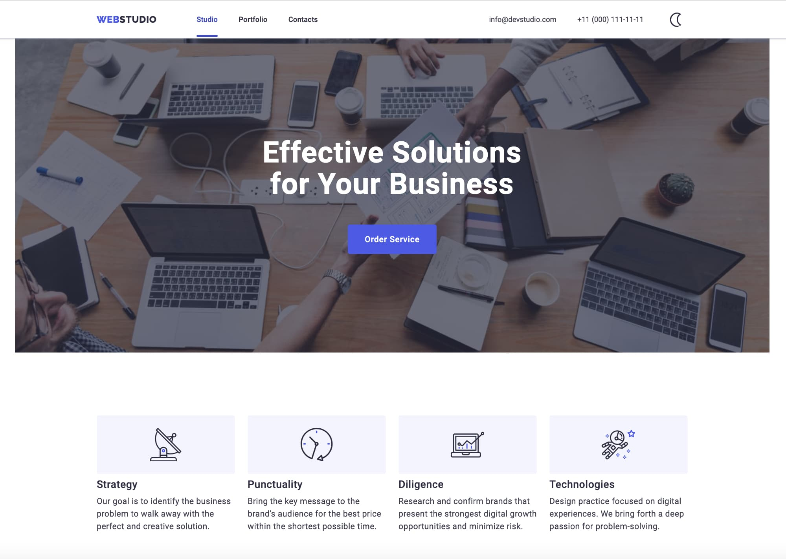
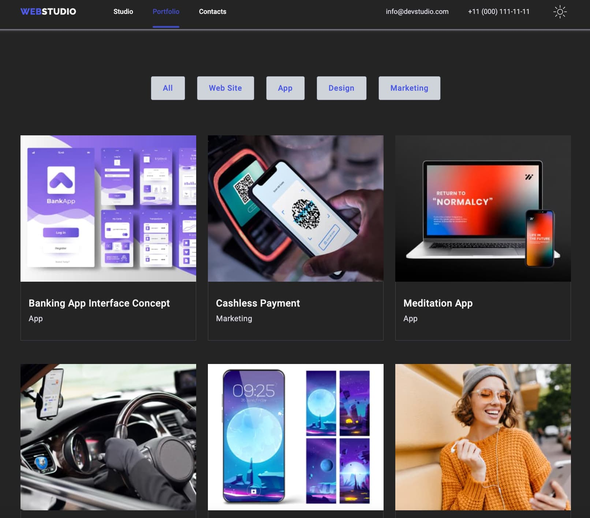

# WebStudio - Responsive Web Design Project

## Overview

WebStudio is a responsive web design project created for a fictional company named "WebStudio." This freelance project focuses on delivering a modern and visually appealing web presence using HTML, CSS, and JavaScript. The website consists of a home page called "Studio" and a portfolio page, each with unique features and functionality.

## Features

- **Responsive Design:** Ensures optimal viewing and interaction experience across a wide range of devices.
- **Interactive CTA Button:** Clicking the Call-to-Action (CTA) button on the Studio page opens a modal window where users can leave their contacts to receive a callback.
- **Burger Menu:** The navigation menu on both the Studio and Portfolio pages is hidden behind a burger icon on laptops and phones, optimizing space and improving navigation on smaller screens.
- **Portfolio Animation:** Hovering over the project cards on the Portfolio page triggers an animation popup, providing additional information about each project.

## Pages

### Studio

- **Introduction:** An explanation of the company's strategy and services.
- **Team Section:** Profile cards featuring members of the WebStudio team.
- **Customers Section:** Logos of satisfied customers.
- **Footer:** Studio information, social media links, and a newsletter subscription.

### Portfolio

- **Project Cards:** Displaying completed works, each with an animation popup when hovered over.

## Screenshots

_Caption for Screenshot 1 (WebStudio Studio Page)_

_Caption for Screenshot 2 (WebStudio Portfolio Page Dark Theme)_

## Usage

- Explore the responsive design on different devices.
- Experience the interactive features on the Studio page, such as the CTA modal window.
- Navigate to the Portfolio page to view project cards with animation popups.

## Contact Us

Leave your contact information in the CTA modal on the Studio page, and we will get back to you as soon as possible.

## About WebStudio

WebStudio is a fictional web design and development studio that focuses on creating innovative and responsive web solutions for clients. Connect with us on social media to stay updated on our latest projects and news.

### Languages and Tools:

  
 

### Connect with me:

  

  

